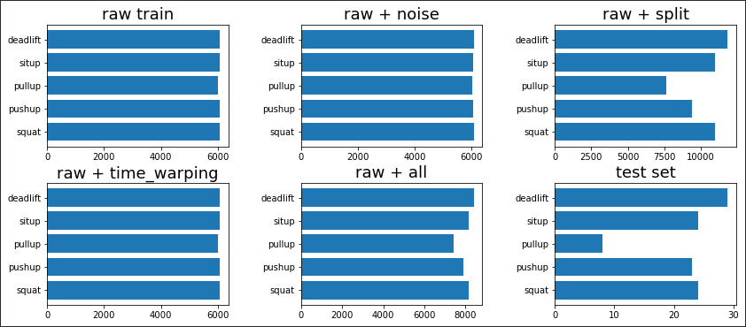

# 버닛 API Docs

### 필요한 라이브러리

**requirements.txt : 코드 실행을 위한 주요 라이브러리 및 버전**

**torch==1.9.0
sklearn==0.24.2
pickle==4.0
tqdm==4.61.1
numpy==1.20.2
matplotlib==3.3.4**

### 주요 코드 설명 및 구동 가이드

1. **augmented.ipynb**

딥러닝 모델 학습을 위한 훈련 데이터를 만드는 코드. raw 데이터를 읽어와서 여러 데이터 증강 기법을 적용하는 코드입니다.

필요한 폴더:

- augmented_txt : 데이터 증강 기법이 적용된 파일 저장
- raw_test :  모델 성능 검증을 위한 raw 데이터
- raw_train : 모델 학습을 위한 raw 데이터
- test_torch : 모델 성능 검증을 위한 최종 torch 데이터
- train_torch : 모델 학습을 위한 최종 훈련 torch 데이터

코드 실행에 앞서 위와 같은 폴더들을 생성한 후, 데이터서버에서 raw_test, raw_train 파일들을 해당 폴더에 넣어줍니다.

데이터 서버 : [http://gofile.me/6UFJt/bVWmB48So](http://gofile.me/6UFJt/bVWmB48So)

```python
### Augment Functions  ###
# 데이터 증강을 위한 module
def augment_module(dir_path, save_path, exercise, aug_num, aug_reps=0, aug_mode='raw'):
    
    files = getfiles(dir_path)
    files = list(filter(lambda x: exercise in x , files)) # get specific exercise files
    
    if aug_mode == 'raw':
        for i in range(aug_num):
            file = random.choice(files)  # randomly select raw sensor data
            no_aug(dir_path, save_path, file)  # raw data sampling

    elif aug_mode == 'noise':
        for i in range(aug_num):
            file = random.choice(files)  # randomly select raw sensor data
            noise(dir_path, save_path, file)  # multiply and add noise

    elif aug_mode == 'warping':
        for i in range(aug_num):
            file = random.choice(files)  # randomly select raw sensor data
            time_warping(dir_path, save_path, file)
            
    elif aug_mode == 'split':
        # split : split based on workout border
        # split_merge : split data two parts based on workout border and merge them
        # permute : get permutations  that based on workout borders, and then data rearrangement 
        split_mode = ['split', 'split_merge', 'permute']
        for i in range(aug_num):
            file = random.choice(files)  # randomly select raw sensor data
            mode = random.choice(split_mode)  # randomly select split mode
            
            if mode == 'permute':
                permute(dir_path, save_path, file)
            elif mode == 'split':
                split(dir_path, save_path, file)
            elif mode == 'split_merge':
                split_merge(dir_path, save_path, file)
    
    elif aug_mode == 'reps_variation':
        files = getfiles(dir_path)

        if exercise != 'any':
            files = list(filter(lambda x: exercise in x , files))  # get specific exercise files

        if aug_reps == 8:
            files = list(filter(lambda x: int(x.split('_')[-1][0]) == 8 , files))
            for i in range(aug_num):
                file = random.choice(files)
                permute(dir_path, save_path, file)
        
        else:
            for i in range(aug_num):
                files = list(filter(lambda x: int(x.split('_')[-1][0]) > aug_reps, files))  # get specific exercise files
                file = random.choice(files)
                split_variation(dir_path, save_path, file, aug_reps)
```

```python
### Main code ###
# select augmentation mode [raw, split, warping, noise]
# 증강기법에 따라서 운동별로 데이터 증강
# aug_num : 데이터 증강 횟수 설정
# aug_mode : 데이터 증강 기법 설정
# aug_reps : 운동별로 원하는 reps 증강.(2~8 reps)
# aug_mode : reps를 증강하기 위한 option

for exer in exercist_list:
    augment_module(dir_path=src_path, save_path=trg_path + 'raw/', exercise=exer, aug_num=6100, aug_mode='raw')
    augment_module(dir_path=src_path, save_path=trg_path + 'warping/', exercise=exer, aug_num=6100, aug_mode='warping')
    augment_module(dir_path=src_path, save_path=trg_path + 'noise/', exercise=exer, aug_num=6100, aug_mode='noise')
    augment_module(dir_path=src_path, save_path=trg_path + 'split/', exercise=exer, aug_num=4500, aug_mode='split')

augment_module(dir_path=src_path, save_path=trg_path + 'split/', exercise='any', aug_num=5000, aug_reps=8, aug_mode='reps_variation')
augment_module(dir_path=src_path, save_path=trg_path + 'split/', exercise='any', aug_num=4000, aug_reps=7, aug_mode='reps_variation')
augment_module(dir_path=src_path, save_path=trg_path + 'split/', exercise='any', aug_num=2500, aug_reps=6, aug_mode='reps_variation')
augment_module(dir_path=src_path, save_path=trg_path + 'split/', exercise='any', aug_num=2000, aug_reps=5, aug_mode='reps_variation')
```

```python
# check data length
# 증강 기법별로 증강된 데이터 개수 확인
path = 'augmented_txt/'
print('raw :', len(getfiles(path + 'raw/')))
print('split_merge :', len(getfiles(path + 'split/')))
print('time_warping :', len(getfiles(path + 'warping/')))
print('noise_injection :', len(getfiles(path + 'noise/')))
print('all_permuted :', len(getfiles(path + 'all/')))
```

```python
### Data Aggregation ###

# 증강기법별 데이터 개수 집계
class_dict = list_of_dicts_class[0]

label = list(class_dict.keys())
index = np.arange(len(label))

# Basic Bar Chart
plt.subplot(2,3,1)
plt.barh(label, list_of_dicts_class[0].values())
plt.title('raw train', fontsize=18)

plt.subplot(2,3,2)
plt.barh(label, list_of_dicts_class[1].values())
plt.title('raw + noise', fontsize=18)

plt.subplot(2,3,3)
plt.barh(label, list_of_dicts_class[2].values())
plt.title('raw + split', fontsize=18)

plt.subplot(2,3,4)
plt.barh(label, list_of_dicts_class[3].values())
plt.title('raw + time_warping', fontsize=18)

plt.subplot(2,3,5)
plt.barh(label, list_of_dicts_class[4].values())
plt.title('raw + all', fontsize=18)

plt.subplot(2,3,6)
plt.barh(label, list_of_dicts_class[5].values())
plt.title('test set', fontsize=18)

# plt.tight_layout()
plt.subplots_adjust(left=0.2, bottom=0.1, right=2.0, top=1.2, wspace=0.4, hspace=0.3)
plt.show()
```



```python
# 횟수별 데이터 개수 집계
label = list(train_raw_reps_dict.keys())
index = np.arange(len(label))

# Basic Bar Chart
plt.subplot(2,3,1)
plt.barh(label, list_of_dicts_reps[0].values())
plt.title('raw train', fontsize=18)

plt.subplot(2,3,2)
plt.barh(label, list_of_dicts_reps[1].values())
plt.title('raw + noise', fontsize=18)

plt.subplot(2,3,3)
plt.barh(label, list_of_dicts_reps[2].values())
plt.title('raw + split', fontsize=18)

plt.subplot(2,3,4)
plt.barh(label, list_of_dicts_reps[3].values())
plt.title('raw + time_warping', fontsize=18)

plt.subplot(2,3,5)
plt.barh(label, list_of_dicts_reps[4].values())
plt.title('raw + all', fontsize=18)

plt.subplot(2,3,6)
plt.barh(label, list_of_dicts_reps[5].values())
plt.title('test set', fontsize=18)

# plt.tight_layout()
plt.subplots_adjust(left=0.2, bottom=0.1, right=2.0, top=1.2, wspace=0.4, hspace=0.3)
plt.show()
```


학습과 검증에 필요한 데이터는 모두 데이터 서버에 있습니다. augmented.ipynb 코드를 실행하지 않아도 데이터서버에 있는 모든 파일들을 다운로드하여도 무방합니다.

1. **train.py**

딥러닝 학습을 위한 main 코드입니다. 

```python
#load train data : 학습에 필요한 훈련 데이터 로드
    if data=='noise':
        with open(dir_path + "/noise.pickle.pkl","rb") as fr:
            train = pickle.load(fr)
    elif data=='split':
        with open(dir_path + "/split.pickle.pkl","rb") as fr:
            train = pickle.load(fr)
    elif data=='time':            
        with open(dir_path + "/warping.pickle.pkl","rb") as fr:
            train = pickle.load(fr)
    elif data=='raw':            
        with open(dir_path + "/raw.pickle.pkl","rb") as fr:
            train = pickle.load(fr)
    elif data=='cat':
        with open(dir_path + "/all.pickle.pkl","rb") as fr:
            train = pickle.load(fr)

    #load test data : 모델 검증에 필요한 검증 데이터 로드
    with open("test_torch/test.pickle.pkl","rb") as fr:
        test = pickle.load(fr)
```

```python
# model,optimizer,scheduler and loss functions Declaration
# checkpoint : pre trained 모델을 불러오는 코드
# Combine_model.load_state_dict : pre trained 모델을 불러오는 코드
# 모델을 불러올 때 위 두개의 코드 주석 풀고 실행
    # checkpoint = torch.load('./model_save/saved_model.pt')
    Combine_model=CNN2D(p=p).to(device)
    # Combine_model.load_state_dict(checkpoint['model_state_dict'], strict=False)
```

```python
#trained model save : 훈련이 다 진행된 후 모델 저장
    model_name=f'saved_model'
    torch.save(Combine_model, 'model_save/'+model_name+'.pt')
```

```python
# 딥러닝 학습 시작하는 main 코드
if __name__ == "__main__":

    train(lr=0.0001,data='cat')
```
